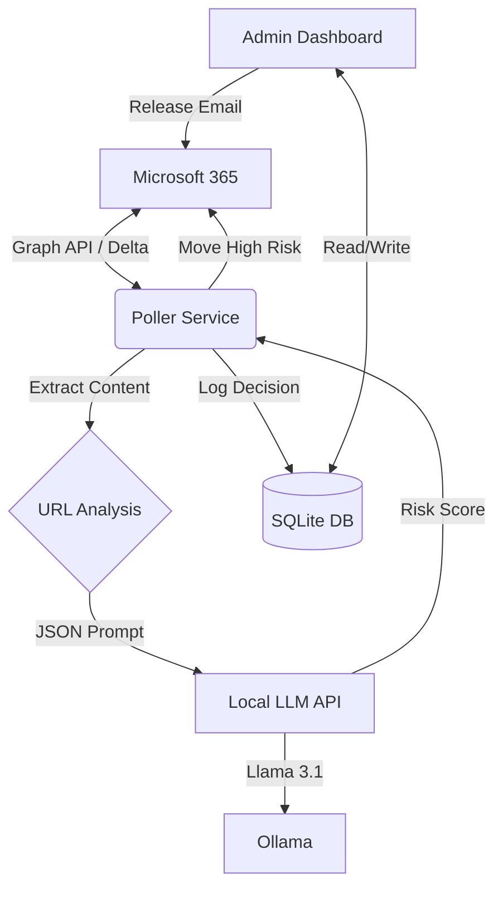

# 👁️ Eye of Sauron: AI Email Filter

A self-hosted Microsoft 365 email security gateway. It polls your inbox, analyzes emails using a local LLM (Llama 3.1), and automatically quarantines threats before they cause harm.

## 🏗️ Architecture



### Key Components
- **Poller (`services/poller.py`)**: Async service that monitors mailboxes using Graph Delta queries. It processes emails in parallel (semaphores) to maximize throughput.
- **URL Engine (`services/url_analysis.py`)**: Static analysis layer that flags suspicious TLDs (`.xyz`, `.top`) and IP-based URLs.
- **LLM Classifier (`llm-api/`)**: A dedicated API wrapper around Ollama that enforces strict JSON output from Llama 3.1 for deterministic scoring.
- **Dashboard (`api/main.py`)**: specific web interface for reviewing decisions, searching logs, and releasing false positives.

---

## 📂 Repository Layout

| Path | Purpose |
| ---- | ------- |
| `api/` | FastAPI admin dashboard & endpoints. |
| `services/` | Core logic: Polling, Graph client, DB access, URL extraction. |
| `llm-api/` | Standalone FastAPI wrapper for Ollama. |
| `templates/` | Jinja2 HTML templates for the dashboard. |
| `data/` | Persistent storage (SQLite `quarantine.db`). |
| `scripts/` | Setup and maintenance scripts. |

---

## 🚀 Quick Start (Development)

### Prerequisites
- **Python 3.10+**
- **Ollama** running `llama3.1:8b`
- **Microsoft Graph App** (Client ID, Tenant ID, Secret) with `Mail.ReadWrite` and `User.Read.All`.

### Installation

1. **Clone & Configure**
   ```bash
   git clone <repo> eye-of-sauron
   cd eye-of-sauron
   cp .env.example .env
   # Edit .env with your credentials
   ```

2. **Bootstrap Environment**
   ```bash
   ./scripts/setup.sh
   source .venv/bin/activate
   ```

3. **Run Services**
   ```bash
   # Terminal 1: Admin Dashboard (Port 8000)
   uvicorn api.main:app --reload --port 8000

   # Terminal 2: LLM Wrapper (Port 8081)
   uvicorn llm-api.api.main:app --port 8081

   # Terminal 3: Email Poller
   python -m services.poller
   ```

---

## 📦 Deployment (Proxmox / Systemd)

Recommended setup: **Two LXC Containers** (separating logic from heavy AI compute).

### 1. LLM Container (`ct-llm`)
- **Role**: Runs Ollama and the LLM API wrapper.
- **Setup**:
  1. Install Ollama: `curl -fsSL https://ollama.com/install.sh | sh`
  2. Pull Model: `ollama pull llama3.1:8b`
  3. Copy `llm-api/` folder to `/opt/llm-api`.
  4. Install dependencies (`fastapi`, `uvicorn`, `httpx`) in a venv.
  5. Create systemd service (see `ai-email-api.service.example` but point to `llm-api`).

### 2. Application Container (`ct-ai-filter`)
- **Role**: Runs the Poller and Admin Dashboard.
- **Setup**:
  1. Clone repo to `/opt/eye-of-sauron`.
  2. Run `scripts/setup.sh`.
  3. Configure `.env` (Point `LLM_API_URL` to `ct-llm` IP).
  4. Install systemd services:
     ```bash
     cp ai-email-poller.service.example /etc/systemd/system/ai-email-poller.service
     cp ai-email-api.service.example /etc/systemd/system/ai-email-api.service
     systemctl enable --now ai-email-poller ai-email-api
     ```

---

## 🛠️ Troubleshooting

| Symptom | Fix |
| ------- | --- |
| **403 Forbidden** | Check Graph API permissions. You need `Mail.ReadWrite` and `User.Read.All`. |
| **LLM Timeout** | Ensure `ct-llm` is reachable. Check firewall/network. |
| **Stale Data** | Delete `state.json` to force a full re-sync of the mailbox. |
| **Dashboard Login** | Default creds are in `.env`. Check `ADMIN_USERNAME`. |

---

## 🔮 Future Roadmap
Check `NOTES.md` for the active development roadmap, including attachment analysis and policy engines.
